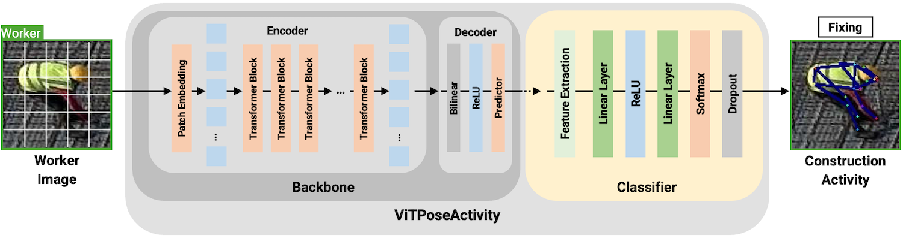

# ViTPoseActivity: Activity Classification from Human Pose Keypoints

**ViTPoseActivity** is a deep learning model for classifying construction worker activities based on pose keypoints extracted from single-frame images. This repository contains the implementation, training pipeline, and Docker deployment setup used in the research presented in [Automation in Construction (2025)](https://doi.org/10.1016/j.autcon.2025.106462).




## What's in This Repository

This repository provides:

- **ViTPoseActivity Model**: A custom neural network architecture that takes 2D pose keypoints as input and classifies activities
- **Training Pipeline**: Complete training loop with data augmentation, validation, and checkpointing
- **Multiple Baseline Models**: Comparison implementations using pretrained models (ResNet, VGG, DenseNet, MobileNet, Swin Transformer)
- **Configuration System**: Centralized config management via environment variables and `config.py`
- **Docker Environment**: Containerized setup for reproducible training and deployment
- **Visualization Tools**: Result plotting and model performance tracking

## Model Architecture

The ViTPoseActivity model processes pose keypoints through:

1. **Input**: 17 body keypoints (x, y, confidence) from COCO format, extracted using easy_ViTPose
2. **Feature Extraction**: Fully connected layers that learn activity-relevant pose features
3. **Classification Head**: Maps learned features to activity classes (e.g., layouting, transporting, fixing)

See `src/vpa_model_architecture.py` and `src/vpa_model.py` for implementation details.

## Quick Start

### Prerequisites

- Docker and NVIDIA Docker Runtime (required for execution)
- NVIDIA GPU with CUDA support
- At least 16GB GPU memory (recommended)

**Note**: This project is designed to run in the provided Docker environment, which includes all necessary dependencies (PyTorch, easy_ViTPose, etc.). Local installation is not officially supported.

### Setup

1. Clone the repository:
```bash
git clone https://github.com/fabianpfitzner/vitpose_activity
cd vitpose_activity
```

2. Build the Docker image:
```bash
cd docker
./build_image.sh
```

### Configuration

**Data Directory**: By default, the training script expects data at `~/vitpose_activity_data` on your host machine. To use a different location, set the `DATA_DIR` variable when running:

```bash
DATA_DIR="/path/to/your/data" ./docker/run-train.sh
```


**Dataset Selection**: By default, the script uses the `dataset_1500` folder inside your data directory. To use a different dataset folder, set the `VPA_DATASET` variable:

```bash
VPA_DATASET="your_dataset_name" ./docker/run-train.sh
```

Or with a custom data directory:

```bash
DATA_DIR="/path/to/your/data" VPA_DATASET="your_dataset_name" ./docker/run-train.sh
```

This will look for your dataset at `${DATA_DIR}/your_dataset_name` on your host machine (which appears as `/workspace/data/your_dataset_name` inside the container).

**Alternative**: You can also change the default dataset name by editing `src/config.py`:
```python
DATASET_NAME = os.getenv('VPA_DATASET', 'your_dataset_name')  # Change 'dataset_1500' to your default
```

**Note**: Do not modify the other paths in `src/config.py` (like `BASE_DIR`, `DATA_DIR`, etc.) - these are internal Docker paths. Only change the `DATA_DIR` mount point in `run-train.sh` and dataset selection via `VPA_DATASET` or the config file default.

**Training Parameters**: You can also configure training parameters via environment variables:

```bash
DATA_DIR="/path/to/your/data" VPA_NUM_EPOCHS=100 VPA_BATCH_SIZE=128 ./docker/run-train.sh
```

### Training

Run training using the Docker container:

```bash
cd docker
./run-train.sh
```

See `docker/README.md` for detailed configuration options and troubleshooting.

## Repository Structure

```
vitpose_activity/
├── src/
│   ├── main.py                      # Main training script
│   ├── config.py                    # Configuration management
│   ├── vpa_model.py                 # ViTPoseActivity model definition
│   ├── vpa_model_architecture.py    # Model architecture components
│   ├── classification_models.py     # Baseline comparison models
│   └── helpers.py                   # Utility functions
├── docker/
│   ├── dockerfile                   # Container definition
│   ├── build_image.sh              # Build script
│   ├── run-train.sh                # Training container script
│   └── run-deploy.sh               # Deployment container script
└── info/                           # Documentation images
```

## Technical Details

- **Input Format**: Pose keypoints in COCO 17-keypoint format (nose, eyes, ears, shoulders, elbows, wrists, hips, knees, ankles)
- **Output**: Activity class probabilities
- **Training**: Cross-entropy loss with Adam optimizer
- **Data Augmentation**: Implemented via pose keypoint transformations
- **Checkpointing**: Best model saved based on validation accuracy

For complete methodology and experimental results, see the [paper](https://doi.org/10.1016/j.autcon.2025.106462).

## Acknowledgments

This project builds upon the work of:

- **ViTPose**: Thanks to the ViTPose authors and their official implementation [ViTAE-Transformer/ViTPose](https://github.com/ViTAE-Transformer/ViTPose)
- **easy_ViTPose**: Thanks to the [easy_ViTPose](https://github.com/JunkyByte/easy_ViTPose) repository for providing a simplified interface to ViTPose models

## License

This project is licensed under the MIT License.

If you use this project for academic research, please cite it.
If you wish to use this project commercially, please contact me first: `fabianpfitzner@gmail.com`.

## Citation

If you use this work in your research, please cite:

```bibtex
@article{PFITZNER2025106462,
  title = {Spatial analysis and complexity evaluation for predicting rebar installation duration},
  journal = {Automation in Construction},
  volume = {179},
  pages = {106462},
  year = {2025},
  issn = {0926-5805},
  doi = {https://doi.org/10.1016/j.autcon.2025.106462},
  url = {https://www.sciencedirect.com/science/article/pii/S0926580525005023},
  author = {Fabian Pfitzner and Alexander Braun and André Borrmann and Frédéric Bosché},
  keywords = {Spatial analysis, Labor productivity, Activity classification, Activity complexity},
  abstract = {Poor predictability of construction project duration and stagnant labor productivity highlight the need for scalable, data-driven monitoring solutions. This paper investigates how the relationship between activity complexity and duration can be quantified and leveraged. A grid-based spatial analysis is introduced to address this gap, combining BIM-derived complexity metrics for individual components (e.g., slabs) with CV-based as-performed activity classification, demonstrated in the context of rebar installation. The proposed activity classification model, ViTPoseActivity, achieves 97% accuracy in detecting on-site tasks using single-frame posture features. Correlation analysis on real-world construction data covering over 1,900 labor hours confirms a measurable positive relationship between activity complexity and duration. By combining as-designed and as-performed data in a spatial context, this paper provides a foundation for activity duration prediction, supporting proactive planning and future research in data-driven site management.}
}
```


